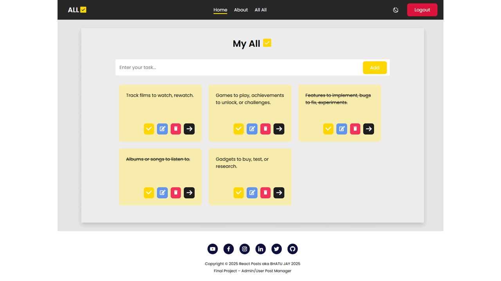
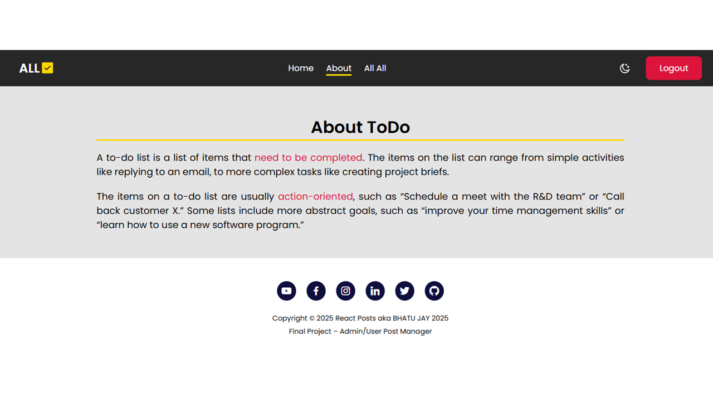
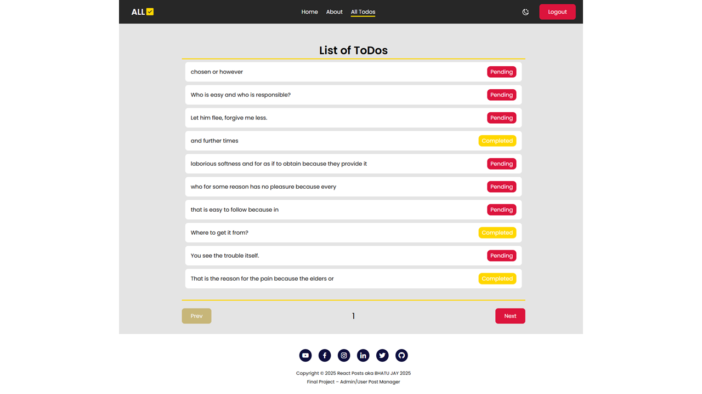
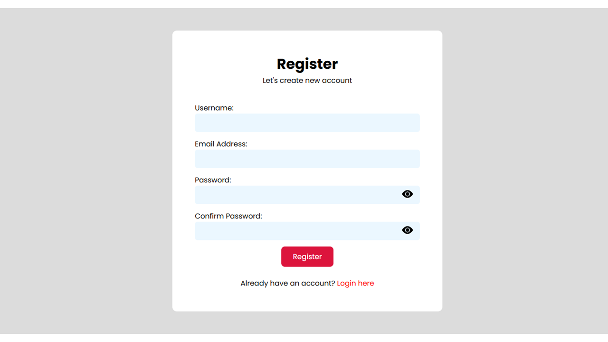
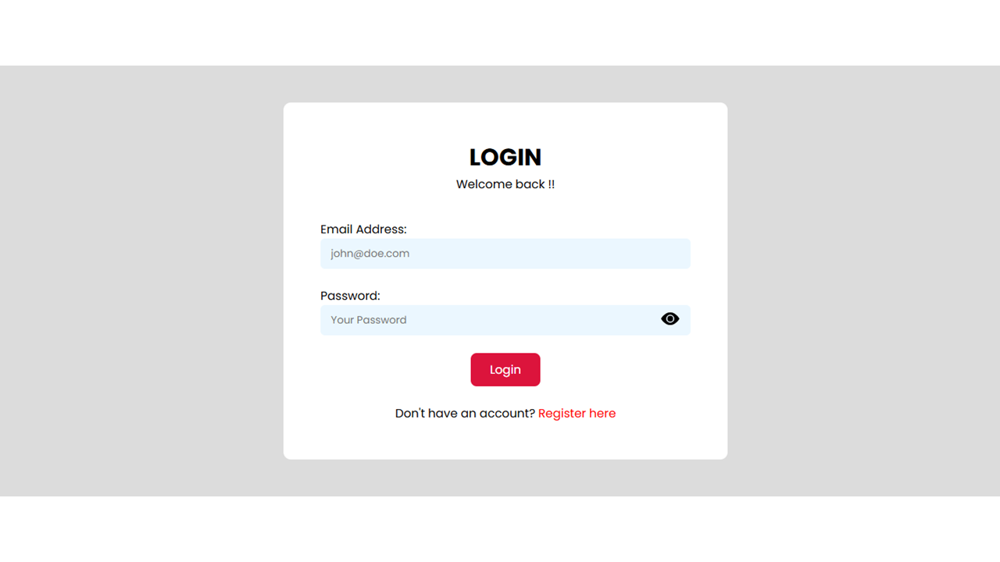

<!-- Banner -->
<p align="center">
  
</p>

<!-- Social Links -->
<p align="center">
  <a href="https://bhatujay.github.io"></a>
  <a href="https://github.com/BhatuJay"></a>
  <a href="https://linkedin.com/in/jaybhatu"></a>
  <a href="https://x.com/AhirBhatuJay"></a>
  <a href="https://instagram.com/jay_bhatu_2135"></a>
  <a href="https://youtube.com/@bhatujay"></a>
</p>

---

## 🚀 Live Demo  

<p align="center">
  <a href="https://react-todo-chi-snowy.vercel.app" target="_blank">
    
  </a>
</p>

<p align="center">
  👉 <a href="https://react-todo-chi-snowy.vercel.app" target="_blank">Click here or LOGO to try Todo App</a>
</p>

---

## 🌟 Project Preview

<p align="center">
  
  <!--  -->
  <!--  -->
  <!--  -->
  <!--  -->
  <!--  -->
</p>

---

## ✨ Features

- 🔐 Simple authentication-like flow with **LocalStorage**  
- ✅ Mark tasks as **Completed** or keep them **Pending**  
- 📝 Add, ✏️ Edit, 👀 View, and ❌ Delete todos  
- 🔍 Search & filter todos by status  
- 💾 Persistent storage using **LocalStorage**  
- 🧹 Clean modular React components  

---

## 🛠 Tech Stack

<p align="center">
  
</p>

- **React** – UI components & state management  
- **Vite** – Super-fast build & dev server  
- **React Router DOM** – Navigation & routing  
- **UUID** – Unique task IDs  
- **LocalStorage** – Data persistence  
- **CSS** – Clean responsive styling  

---

## ⚡ Getting Started

```bash
# Clone the repo
git clone https://github.com/BhatuJay/react-todo.git
cd react-todo

# Install dependencies
npm install

# Run dev server
npm run dev

# Build for production
npm run build

# Preview production build
npm run preview
